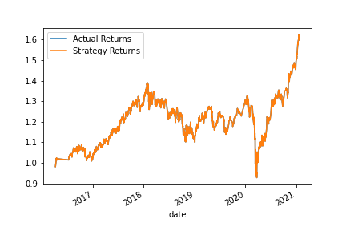

# Challenge14

This is a program that decides how to trade a security and fits it to data using two machine learning methods: support vector machines and XGBoost.

---

## Technologies

This project leverages python 3.7 with the following packages:


* [pandas](https://github.com/pandas-dev/pandas) - Flexible and powerful data analysis / manipulation library for Python, providing labeled data structures similar to R data.frame objects, statistical functions, and much more

* [pathlib](https://github.com/budlight/pathlib) - Specifies a path

* [numpy](https://github.com/numpy/numpy) - Fundamental package for scientific computing for Python.

* [scikit-learn](https://github.com/scikit-learn/scikit-learn) - scikit-learn: machine learning in Python.

* [hvplot](https://github.com/holoviz/hvplot) - A high-level plotting API for pandas, dask, xarray, and networkx built on HoloViews.


---

## Installation Guide

Before running the application first install the following dependencies.

```python
conda install -c conda-forge numpy
conda install -c conda-forge pandas
conda install -c conda-forge scikit-learn
conda install -c anaconda hvplot
```

---

## Usage

This application runs a fixed program for analysis.  The application can be manipulated by interacting with the generated plots to look through the different results.

## Contributors

Brought to you by Russell Moore & Columbia Fintech Bootcamp.

---
## License

Open Source

## Version

First Version and only version as everything ran smoothly.

## Evaluation Report

In the findings, the SVM machine learning method fit the early data rather well until around 2019 where it starts to diverge.  XGBoost did not fit as well and it is suspected that it over fit due to the nature of the algorithm.


The accuracy of the longer training window went up, but that is mainly because there are fewer opportunities to buy.



The effect of halving the SMA made it so that the model more closely followed the returns, but if it makes a mistake, it really makes one.  This means the accuracy is not affected so much.


